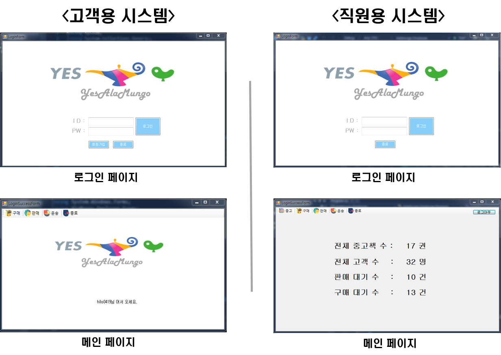
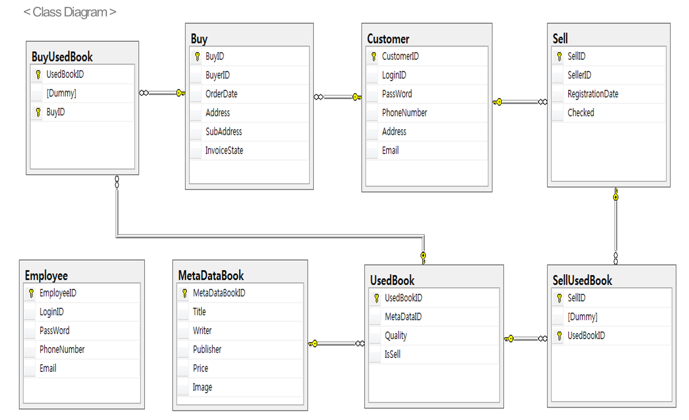

# YesAlaMungo

- 중고 서점의 시스템을 분석하여 책 판매 등록, 구매, 운송 조회 기능을 구현한 프로그램 입니다.

# 개요

- 본 프로그램은 고객용 Form과 직원용 Form을 따로 구현하여 중고 도서 판매시스템의 일부를 구현 한 것입니다.

- 각 폼마다 User Control과 Grid 부분을 분할 하여 폼을 작성하여 추후의 코드 추가, 삭제, 수정이 용이하다록 코드를 관리하고 있습니다.

- MSSQL 기반의 DB 서버에 저장된 데이터를 가져와 사용자에게 보여주는 형식의 프로그램입니다.

# 시스템 구조

- 프로그램 실행 시 화면

고객 Form에서 신청한 도서 구매 내역 및 도서 판매 허가 관리를 직원 Form에서 처리하는 구조 입니다.

- DB Class Diagram

# 개발 환경

- OS : Windows 7 Professional K

- CPU : IntelⓇ Core™ i7-4790 CPU @ 3.60GHz

- RAM : 8GB

- IDE : Microsoft Visual Studio Community 2019 버전 16.0.3

- 언어 : C# Microsoft .NET Framework 4.6

# 구동 영상 URL

[바로 가기](https://youtu.be/vlwha9ZP828)

# 추후 개선사항

- 프로그램을 실행하는 순간 DB에서 데이터를 가져오는 구조라서 두 개의 플랫폼을 동시에 띄우고 작업할 경우 실시간으로 DB가 처리되지 않는 점을 해결해야 한다.

- 고객 폼에서 도서 구매시 배송지 주소를 입력하는 부분을 콤보박스로 대처해 도/시/군을 선택할 수 있게 해 편의성을 높일 필요성이 있다.
